# Entity-Relationship Diagram

Database schema for the multi-tenant CMS platform. The system is organized into four
domain groups: **Auth & Tenants** (identity, RBAC, audit), **Content** (articles, cases,
FAQ, reviews), **Company** (services, employees, practice areas, contacts), and
**Catalog** (products, categories, parameters).

All tenant-scoped entities carry a `tenant_id` foreign key for data isolation.
Localized content is stored in separate `*_locale` tables keyed by `(parent_id, locale)`.

```mermaid
erDiagram

    %% ========================================================================
    %% AUTH & TENANTS
    %% ========================================================================

    Tenant {
        uuid id PK
        string name
        string slug UK
        string domain
        boolean is_active
        datetime deleted_at
        int version
    }

    TenantSettings {
        uuid id PK
        uuid tenant_id FK
        string default_locale
        string timezone
        boolean notify_on_inquiry
        string email_provider
        string site_url
    }

    TenantDomain {
        uuid id PK
        uuid tenant_id FK
        string domain UK
        boolean is_primary
        string ssl_status
    }

    FeatureFlag {
        uuid id PK
        uuid tenant_id FK
        string feature_name
        boolean enabled
    }

    AdminUser {
        uuid id PK
        uuid tenant_id FK
        uuid role_id FK
        string email
        string first_name
        string last_name
        boolean is_active
        boolean is_superuser
        datetime deleted_at
        int version
    }

    Role {
        uuid id PK
        uuid tenant_id FK
        string name
        boolean is_system
    }

    Permission {
        uuid id PK
        string code UK
        string resource
        string action
    }

    RolePermission {
        uuid id PK
        uuid role_id FK
        uuid permission_id FK
    }

    AuditLog {
        uuid id PK
        uuid tenant_id FK
        uuid user_id FK
        string resource_type
        uuid resource_id
        string action
        jsonb changes
        datetime created_at
    }

    Tenant ||--o| TenantSettings : "has"
    Tenant ||--o{ TenantDomain : "has"
    Tenant ||--o{ FeatureFlag : "has"
    Tenant ||--o{ AdminUser : "has"
    Tenant ||--o{ Role : "has"
    Tenant ||--o{ AuditLog : "has"
    Role ||--o{ RolePermission : "grants"
    Permission ||--o{ RolePermission : "assigned via"
    Role ||--o{ AdminUser : "assigned to"
    AdminUser ||--o{ AuditLog : "performs"

    %% ========================================================================
    %% CONTENT
    %% ========================================================================

    Article {
        uuid id PK
        uuid tenant_id FK
        uuid author_id FK
        string status
        datetime published_at
        string cover_image_url
        int view_count
        int sort_order
        int version
    }

    ArticleLocale {
        uuid id PK
        uuid article_id FK
        string locale
        string title
        string slug
        text content
        string meta_title
        string meta_description
    }

    Topic {
        uuid id PK
        uuid tenant_id FK
        string icon
        string color
        int sort_order
        int version
    }

    TopicLocale {
        uuid id PK
        uuid topic_id FK
        string locale
        string title
        string slug
    }

    ArticleTopic {
        uuid id PK
        uuid article_id FK
        uuid topic_id FK
    }

    FAQ {
        uuid id PK
        uuid tenant_id FK
        string category
        boolean is_published
        int sort_order
        int version
    }

    FAQLocale {
        uuid id PK
        uuid faq_id FK
        string locale
        string question
        text answer
    }

    Case {
        uuid id PK
        uuid tenant_id FK
        string status
        datetime published_at
        string cover_image_url
        string client_name
        int project_year
        boolean is_featured
        int sort_order
        int version
    }

    CaseLocale {
        uuid id PK
        uuid case_id FK
        string locale
        string title
        string slug
        text description
        text results
    }

    CaseContact {
        uuid id PK
        uuid case_id FK
        string contact_type
        string value
        int sort_order
    }

    CaseServiceLink {
        uuid id PK
        uuid case_id FK
        uuid service_id FK
    }

    Review {
        uuid id PK
        uuid tenant_id FK
        uuid case_id FK
        string status
        int rating
        string author_name
        text content
        boolean is_featured
        string source
        int sort_order
        int version
    }

    ReviewAuthorContact {
        uuid id PK
        uuid review_id FK
        string contact_type
        string value
        int sort_order
    }

    ContentBlock {
        uuid id PK
        uuid tenant_id FK
        string entity_type
        uuid entity_id
        string locale
        string block_type
        string title
        text content
        string media_url
        int sort_order
    }

    Article ||--o{ ArticleLocale : "locales"
    Article ||--o{ ArticleTopic : "tagged"
    Topic ||--o{ TopicLocale : "locales"
    Topic ||--o{ ArticleTopic : "tagged"
    AdminUser ||--o{ Article : "authors"
    FAQ ||--o{ FAQLocale : "locales"
    Case ||--o{ CaseLocale : "locales"
    Case ||--o{ CaseContact : "contacts"
    Case ||--o{ CaseServiceLink : "linked services"
    Case ||--o{ Review : "reviews"
    Review ||--o{ ReviewAuthorContact : "contacts"

    %% ========================================================================
    %% COMPANY
    %% ========================================================================

    Service {
        uuid id PK
        uuid tenant_id FK
        string icon
        string image_url
        int price_from
        string price_currency
        boolean is_published
        int sort_order
        int version
    }

    ServiceLocale {
        uuid id PK
        uuid service_id FK
        string locale
        string title
        string slug
        text description
    }

    ServicePrice {
        uuid id PK
        uuid service_id FK
        string locale
        decimal price
        string currency
    }

    ServiceTag {
        uuid id PK
        uuid service_id FK
        string locale
        string tag
    }

    Employee {
        uuid id PK
        uuid tenant_id FK
        string photo_url
        string email
        string phone
        boolean is_published
        int sort_order
        int version
    }

    EmployeeLocale {
        uuid id PK
        uuid employee_id FK
        string locale
        string first_name
        string last_name
        string position
        string slug
    }

    EmployeePracticeArea {
        uuid id PK
        uuid employee_id FK
        uuid practice_area_id FK
    }

    PracticeArea {
        uuid id PK
        uuid tenant_id FK
        string icon
        boolean is_published
        int sort_order
        int version
    }

    PracticeAreaLocale {
        uuid id PK
        uuid practice_area_id FK
        string locale
        string title
        string slug
    }

    Advantage {
        uuid id PK
        uuid tenant_id FK
        string icon
        boolean is_published
        int sort_order
        int version
    }

    AdvantageLocale {
        uuid id PK
        uuid advantage_id FK
        string locale
        string title
        text description
    }

    Address {
        uuid id PK
        uuid tenant_id FK
        string address_type
        float latitude
        float longitude
        boolean is_primary
        int sort_order
    }

    AddressLocale {
        uuid id PK
        uuid address_id FK
        string locale
        string city
        string street
        string postal_code
    }

    Contact {
        uuid id PK
        uuid tenant_id FK
        string contact_type
        string value
        string label
        boolean is_primary
        int sort_order
    }

    Service ||--o{ ServiceLocale : "locales"
    Service ||--o{ ServicePrice : "prices"
    Service ||--o{ ServiceTag : "tags"
    Service ||--o{ CaseServiceLink : "case links"
    Employee ||--o{ EmployeeLocale : "locales"
    Employee ||--o{ EmployeePracticeArea : "specializes"
    PracticeArea ||--o{ PracticeAreaLocale : "locales"
    PracticeArea ||--o{ EmployeePracticeArea : "specialists"
    Advantage ||--o{ AdvantageLocale : "locales"
    Address ||--o{ AddressLocale : "locales"

    %% ========================================================================
    %% CATALOG
    %% ========================================================================

    UOM {
        uuid id PK
        uuid tenant_id FK
        string name
        string code
        string symbol
        boolean is_active
    }

    Category {
        uuid id PK
        uuid tenant_id FK
        uuid parent_id FK
        string title
        string slug
        boolean is_active
        int sort_order
        int version
    }

    Product {
        uuid id PK
        uuid tenant_id FK
        uuid uom_id FK
        string sku
        string slug
        string title
        string brand
        string model
        boolean is_active
        int version
    }

    ProductImage {
        uuid id PK
        uuid product_id FK
        string url
        string alt
        int sort_order
        boolean is_cover
    }

    ProductChar {
        uuid id PK
        uuid product_id FK
        uuid uom_id FK
        string name
        text value_text
    }

    ProductAlias {
        uuid id PK
        uuid product_id FK
        text alias
    }

    ProductAnalog {
        uuid product_id PK
        uuid analog_product_id PK
        string relation
    }

    ProductCategory {
        uuid id PK
        uuid product_id FK
        uuid category_id FK
        boolean is_primary
    }

    ProductPrice {
        uuid id PK
        uuid product_id FK
        string price_type
        decimal amount
        string currency
        date valid_from
        date valid_to
    }

    Parameter {
        uuid id PK
        uuid tenant_id FK
        uuid uom_id FK
        string name
        string value_type
        string scope
        boolean is_filterable
        boolean is_required
        int sort_order
    }

    ParameterValue {
        uuid id PK
        uuid parameter_id FK
        string label
        string code
        int sort_order
        boolean is_active
    }

    ProductCharacteristic {
        uuid id PK
        uuid product_id FK
        uuid parameter_id FK
        uuid parameter_value_id FK
        uuid uom_id FK
        text value_text
        decimal value_number
        boolean value_bool
        string source_type
    }

    Category ||--o{ Category : "children"
    Category ||--o{ ProductCategory : "products"
    Product ||--o{ ProductImage : "images"
    Product ||--o{ ProductChar : "chars"
    Product ||--o{ ProductAlias : "aliases"
    Product ||--o{ ProductCategory : "categories"
    Product ||--o{ ProductPrice : "prices"
    Product ||--o{ ProductCharacteristic : "characteristics"
    Product }o--o{ Product : "analogs"
    UOM ||--o{ Product : "unit"
    UOM ||--o{ ProductChar : "unit"
    UOM ||--o{ Parameter : "unit"
    Parameter ||--o{ ParameterValue : "enum values"
    Parameter ||--o{ ProductCharacteristic : "defines"
    ParameterValue ||--o{ ProductCharacteristic : "selected value"
```

